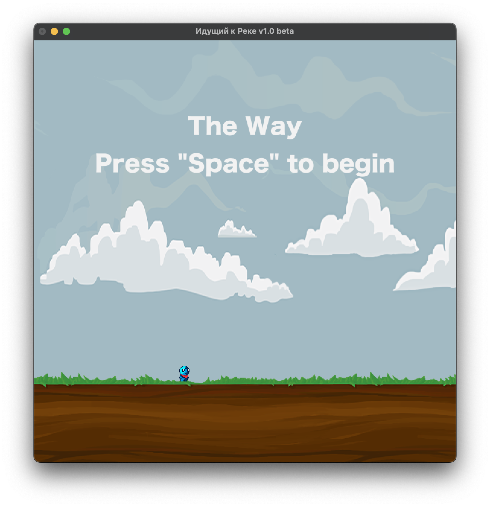
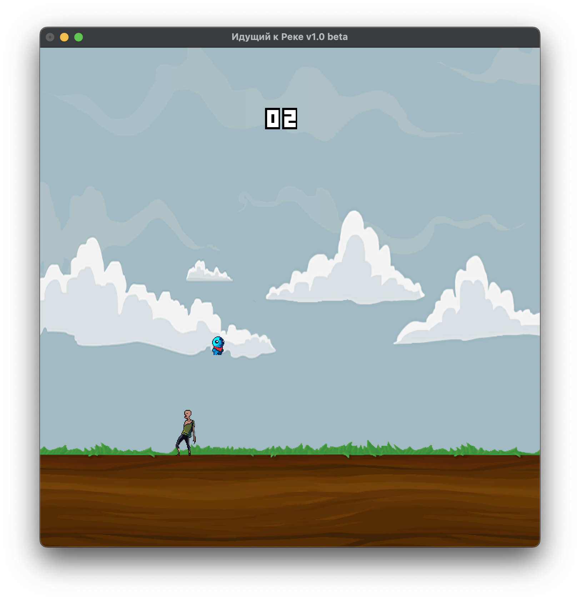
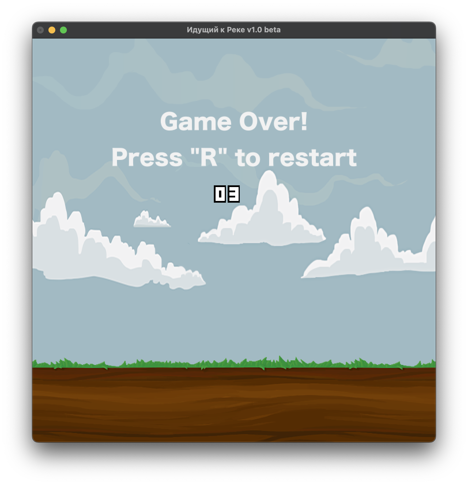

# haskell-project



This a simple runner game written in Haskell using the Gloss library. The goal of the game is to avoid the obstacles and collect as many points as possible. The points are gained by avoiding the obstacles. The game ends when the player hits an obstacle.

### Game controls
* To start the game press `Space`
* `Space` to jump over the obstacles
* After the game ends press `R` to restart the game

### How to run the game
To run this project you should simply run the following command in the project directory:
```bash
stack run
```

### Gameplay





### Sprites

[Tiny Hero Sprites](https://craftpix.net/freebies/free-pixel-art-tiny-hero-sprites/)
[Free Zombie Sprite Sheet Pack Pixel Art](https://craftpix.net/freebies/free-zombie-sprite-sheet-pack-pixel-art/)
[Haskell Flappy Bird](https://github.com/lollobaldo/Haskell-Flappy-Bird/tree/master/sprites)
